# Architecture Diagrams
## Currency Exchange Rates Provider Service

**Version:** 1.0  
**Date:** October 17, 2025  
**Project:** aidemo1

---

## Table of Contents
1. [System Architecture](#system-architecture)
2. [Database Schema](#database-schema)
3. [API Flow Diagrams](#api-flow-diagrams)
4. [Deployment Architecture](#deployment-architecture)
5. [Security Flow](#security-flow)
6. [Provider Integration Flow](#provider-integration-flow)

---

## System Architecture

### Component Architecture

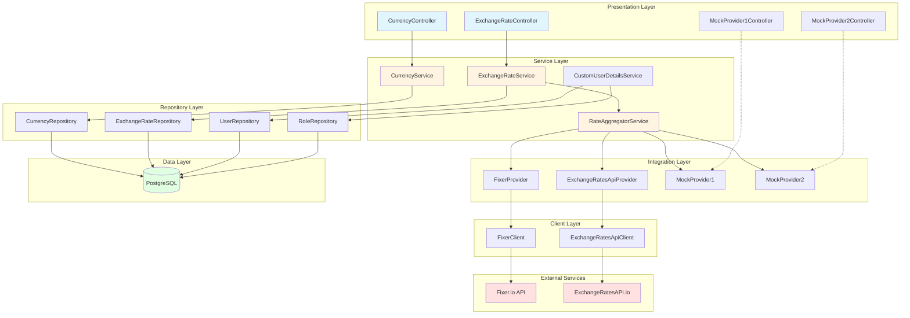
```mermaid
graph TB
    subgraph "Presentation Layer"
        CC[CurrencyController]
        ERC[ExchangeRateController]
        MC1[MockProvider1Controller]
        MC2[MockProvider2Controller]
    end
    
    subgraph "Service Layer"
        CS[CurrencyService]
        ERS[ExchangeRateService]
        RAS[RateAggregatorService]
        UDS[CustomUserDetailsService]
    end
    
    subgraph "Integration Layer"
        FP[FixerProvider]
        EP[ExchangeRatesApiProvider]
        MP1[MockProvider1]
        MP2[MockProvider2]
    end
    
    subgraph "Client Layer"
        FC[FixerClient]
        EC[ExchangeRatesApiClient]
    end
    
    subgraph "Repository Layer"
        CR[CurrencyRepository]
        ERR[ExchangeRateRepository]
        UR[UserRepository]
        RR[RoleRepository]
    end
    
    subgraph "Data Layer"
        DB[(PostgreSQL)]
    end
    
    subgraph "External Services"
        FAPI[Fixer.io API]
        EAPI[ExchangeRatesAPI.io]
    end
    
    CC --> CS
    ERC --> ERS
    ERS --> RAS
    RAS --> FP
    RAS --> EP
    RAS --> MP1
    RAS --> MP2
    
    FP --> FC
    EP --> EC
    FC --> FAPI
    EC --> EAPI
    
    CS --> CR
    ERS --> ERR
    UDS --> UR
    UDS --> RR
    
    CR --> DB
    ERR --> DB
    UR --> DB
    RR --> DB
    
    MC1 -.-> MP1
    MC2 -.-> MP2
    
    style CC fill:#e1f5ff
    style ERC fill:#e1f5ff
    style CS fill:#fff4e1
    style ERS fill:#fff4e1
    style RAS fill:#fff4e1
    style DB fill:#e1ffe1
    style FAPI fill:#ffe1e1
    style EAPI fill:#ffe1e1
```

### Layered Architecture

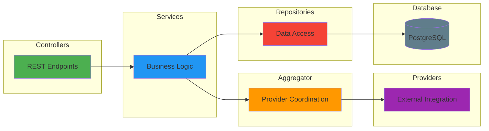
```mermaid
graph LR
    subgraph "Controllers"
        A[REST Endpoints]
    end
    
    subgraph "Services"
        B[Business Logic]
    end
    
    subgraph "Aggregator"
        C[Provider Coordination]
    end
    
    subgraph "Providers"
        D[External Integration]
    end
    
    subgraph "Repositories"
        E[Data Access]
    end
    
    subgraph "Database"
        F[(PostgreSQL)]
    end
    
    A --> B
    B --> C
    C --> D
    B --> E
    E --> F
    
    style A fill:#4CAF50
    style B fill:#2196F3
    style C fill:#FF9800
    style D fill:#9C27B0
    style E fill:#F44336
    style F fill:#607D8B
```

---

## Database Schema

### Entity Relationship Diagram

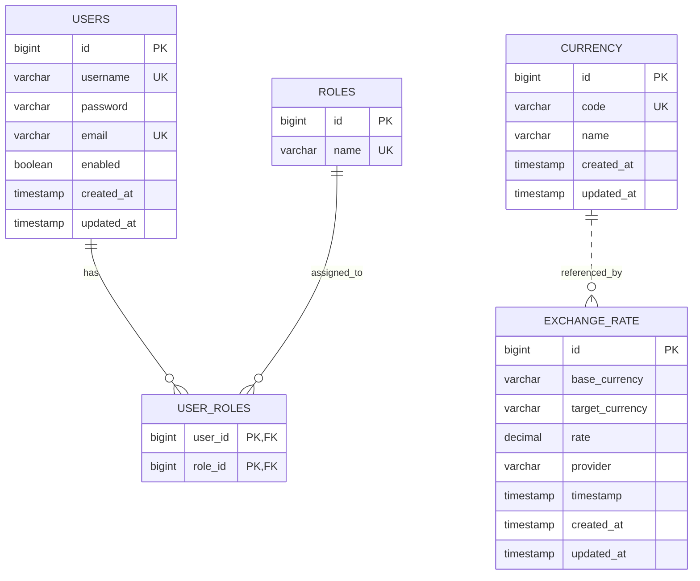
```mermaid
erDiagram
    USERS ||--o{ USER_ROLES : has
    ROLES ||--o{ USER_ROLES : assigned_to
    CURRENCY ||..o{ EXCHANGE_RATE : referenced_by
    
    USERS {
        bigint id PK
        varchar username UK
        varchar password
        varchar email UK
        boolean enabled
        timestamp created_at
        timestamp updated_at
    }
    
    ROLES {
        bigint id PK
        varchar name UK
    }
    
    USER_ROLES {
        bigint user_id PK,FK
        bigint role_id PK,FK
    }
    
    CURRENCY {
        bigint id PK
        varchar code UK
        varchar name
        timestamp created_at
        timestamp updated_at
    }
    
    EXCHANGE_RATE {
        bigint id PK
        varchar base_currency
        varchar target_currency
        decimal rate
        varchar provider
        timestamp timestamp
        timestamp created_at
        timestamp updated_at
    }
```

### Database Schema Details

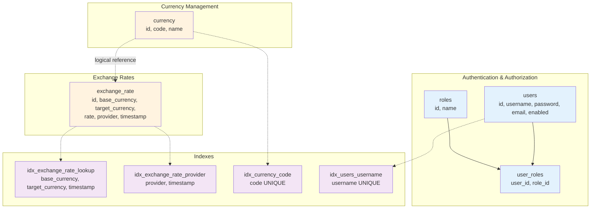
```mermaid
graph TB
    subgraph "Authentication & Authorization"
        U[users<br/>id, username, password, email, enabled]
        R[roles<br/>id, name]
        UR[user_roles<br/>user_id, role_id]
        U --> UR
        R --> UR
    end
    
    subgraph "Currency Management"
        C[currency<br/>id, code, name]
    end
    
    subgraph "Exchange Rates"
        ER[exchange_rate<br/>id, base_currency, target_currency,<br/>rate, provider, timestamp]
        C -.logical reference.-> ER
    end
    
    subgraph "Indexes"
        I1[idx_exchange_rate_lookup<br/>base_currency, target_currency, timestamp]
        I2[idx_exchange_rate_provider<br/>provider, timestamp]
        I3[idx_currency_code<br/>code UNIQUE]
        I4[idx_users_username<br/>username UNIQUE]
    end
    
    ER -.-> I1
    ER -.-> I2
    C -.-> I3
    U -.-> I4
    
    style U fill:#e3f2fd
    style R fill:#e3f2fd
    style UR fill:#e3f2fd
    style C fill:#fff3e0
    style ER fill:#fff3e0
    style I1 fill:#f3e5f5
    style I2 fill:#f3e5f5
    style I3 fill:#f3e5f5
    style I4 fill:#f3e5f5
```

---

## API Flow Diagrams

### Exchange Rate Retrieval Flow

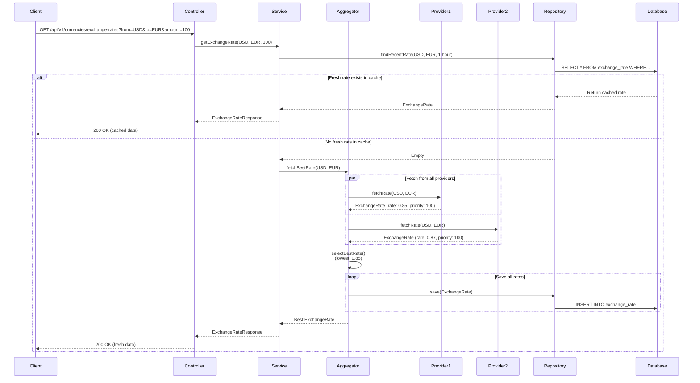
```mermaid
sequenceDiagram
    participant Client
    participant Controller
    participant Service
    participant Aggregator
    participant Provider1
    participant Provider2
    participant Repository
    participant Database
    
    Client->>Controller: GET /api/v1/currencies/exchange-rates?from=USD&to=EUR&amount=100
    Controller->>Service: getExchangeRate(USD, EUR, 100)
    Service->>Repository: findRecentRate(USD, EUR, 1 hour)
    Repository->>Database: SELECT * FROM exchange_rate WHERE...
    
    alt Fresh rate exists in cache
        Database-->>Repository: Return cached rate
        Repository-->>Service: ExchangeRate
        Service-->>Controller: ExchangeRateResponse
        Controller-->>Client: 200 OK (cached data)
    else No fresh rate in cache
        Repository-->>Service: Empty
        Service->>Aggregator: fetchBestRate(USD, EUR)
        
        par Fetch from all providers
            Aggregator->>Provider1: fetchRate(USD, EUR)
            Provider1-->>Aggregator: ExchangeRate (rate: 0.85, priority: 100)
        and
            Aggregator->>Provider2: fetchRate(USD, EUR)
            Provider2-->>Aggregator: ExchangeRate (rate: 0.87, priority: 100)
        end
        
        Aggregator->>Aggregator: selectBestRate()<br/>(lowest: 0.85)
        
        loop Save all rates
            Aggregator->>Repository: save(ExchangeRate)
            Repository->>Database: INSERT INTO exchange_rate
        end
        
        Aggregator-->>Service: Best ExchangeRate
        Service-->>Controller: ExchangeRateResponse
        Controller-->>Client: 200 OK (fresh data)
    end
```

### Add Currency Flow

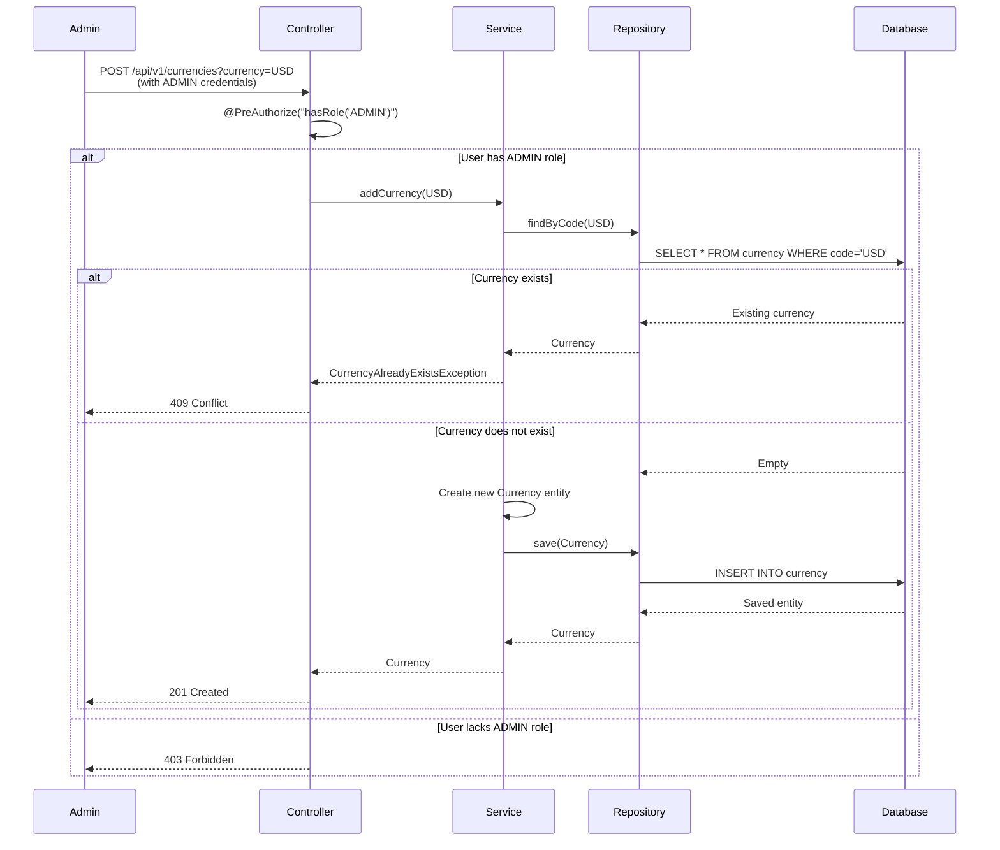
```mermaid
sequenceDiagram
    participant Admin
    participant Controller
    participant Service
    participant Repository
    participant Database
    
    Admin->>Controller: POST /api/v1/currencies?currency=USD<br/>(with ADMIN credentials)
    Controller->>Controller: @PreAuthorize("hasRole('ADMIN')")
    
    alt User has ADMIN role
        Controller->>Service: addCurrency(USD)
        Service->>Repository: findByCode(USD)
        Repository->>Database: SELECT * FROM currency WHERE code='USD'
        
        alt Currency exists
            Database-->>Repository: Existing currency
            Repository-->>Service: Currency
            Service-->>Controller: CurrencyAlreadyExistsException
            Controller-->>Admin: 409 Conflict
        else Currency does not exist
            Database-->>Repository: Empty
            Service->>Service: Create new Currency entity
            Service->>Repository: save(Currency)
            Repository->>Database: INSERT INTO currency
            Database-->>Repository: Saved entity
            Repository-->>Service: Currency
            Service-->>Controller: Currency
            Controller-->>Admin: 201 Created
        end
    else User lacks ADMIN role
        Controller-->>Admin: 403 Forbidden
    end
```

### Trend Analysis Flow

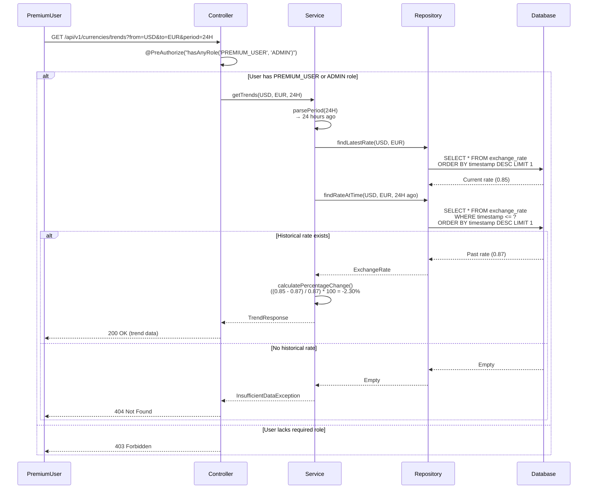
```mermaid
sequenceDiagram
    participant PremiumUser
    participant Controller
    participant Service
    participant Repository
    participant Database
    
    PremiumUser->>Controller: GET /api/v1/currencies/trends?from=USD&to=EUR&period=24H
    Controller->>Controller: @PreAuthorize("hasAnyRole('PREMIUM_USER', 'ADMIN')")
    
    alt User has PREMIUM_USER or ADMIN role
        Controller->>Service: getTrends(USD, EUR, 24H)
        Service->>Service: parsePeriod(24H)<br/>→ 24 hours ago
        
        Service->>Repository: findLatestRate(USD, EUR)
        Repository->>Database: SELECT * FROM exchange_rate<br/>ORDER BY timestamp DESC LIMIT 1
        Database-->>Repository: Current rate (0.85)
        
        Service->>Repository: findRateAtTime(USD, EUR, 24H ago)
        Repository->>Database: SELECT * FROM exchange_rate<br/>WHERE timestamp <= ?<br/>ORDER BY timestamp DESC LIMIT 1
        
        alt Historical rate exists
            Database-->>Repository: Past rate (0.87)
            Repository-->>Service: ExchangeRate
            Service->>Service: calculatePercentageChange()<br/>((0.85 - 0.87) / 0.87) * 100 = -2.30%
            Service-->>Controller: TrendResponse
            Controller-->>PremiumUser: 200 OK (trend data)
        else No historical rate
            Database-->>Repository: Empty
            Repository-->>Service: Empty
            Service-->>Controller: InsufficientDataException
            Controller-->>PremiumUser: 404 Not Found
        end
    else User lacks required role
        Controller-->>PremiumUser: 403 Forbidden
    end
```

---

## Deployment Architecture

### Docker Compose Architecture

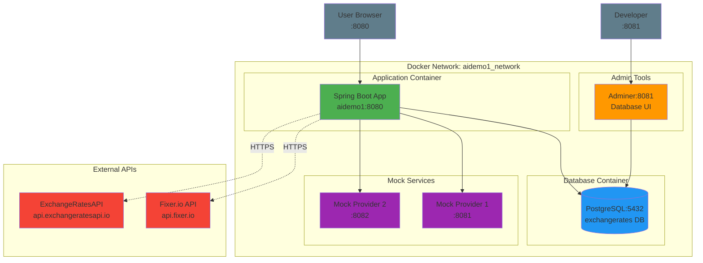
```mermaid
graph TB
    subgraph "Docker Network: aidemo1_network"
        subgraph "Application Container"
            APP[Spring Boot App<br/>aidemo1:8080]
        end
        
        subgraph "Database Container"
            DB[(PostgreSQL:5432<br/>exchangerates DB)]
        end
        
        subgraph "Admin Tools"
            ADM[Adminer:8081<br/>Database UI]
        end
        
        subgraph "Mock Services"
            M1[Mock Provider 1<br/>:8081]
            M2[Mock Provider 2<br/>:8082]
        end
    end
    
    subgraph "External APIs"
        FIXER[Fixer.io API<br/>api.fixer.io]
        EXAPI[ExchangeRatesAPI<br/>api.exchangeratesapi.io]
    end
    
    USER[User Browser<br/>:8080]
    DEVDB[Developer<br/>:8081]
    
    USER --> APP
    DEVDB --> ADM
    APP --> DB
    ADM --> DB
    APP --> M1
    APP --> M2
    APP -.->|HTTPS| FIXER
    APP -.->|HTTPS| EXAPI
    
    style APP fill:#4CAF50
    style DB fill:#2196F3
    style ADM fill:#FF9800
    style M1 fill:#9C27B0
    style M2 fill:#9C27B0
    style FIXER fill:#F44336
    style EXAPI fill:#F44336
    style USER fill:#607D8B
    style DEVDB fill:#607D8B
```

### Container Dependencies

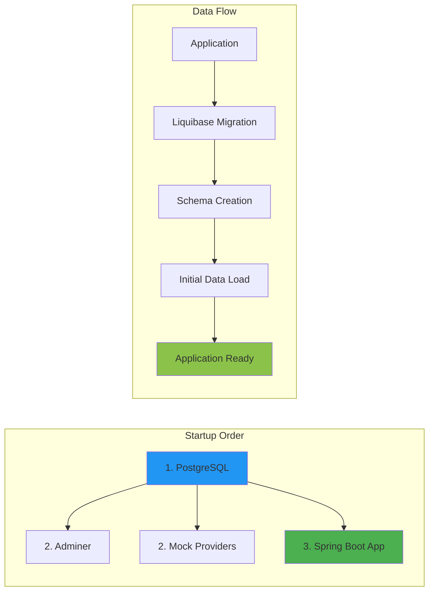
```mermaid
graph LR
    subgraph "Startup Order"
        direction TB
        A[1. PostgreSQL] --> B[2. Adminer]
        A --> C[2. Mock Providers]
        A --> D[3. Spring Boot App]
    end
    
    subgraph "Data Flow"
        direction TB
        E[Application] --> F[Liquibase Migration]
        F --> G[Schema Creation]
        G --> H[Initial Data Load]
        H --> I[Application Ready]
    end
    
    style A fill:#2196F3
    style D fill:#4CAF50
    style I fill:#8BC34A
```

---

## Security Flow

### Authentication Flow

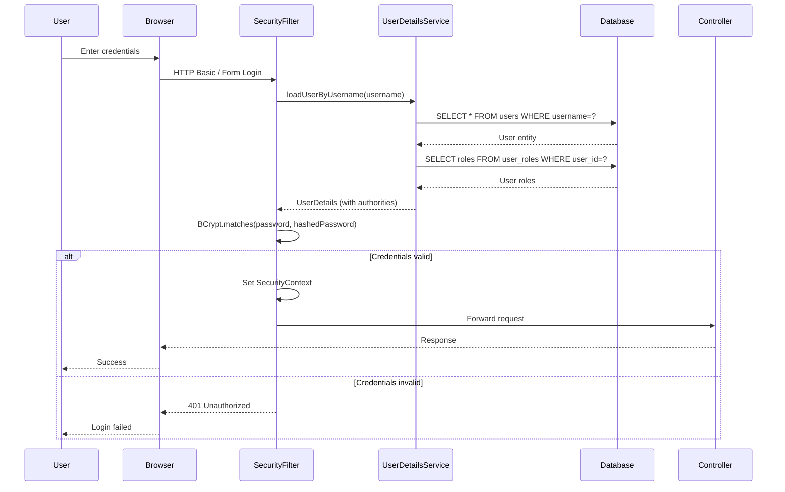
```mermaid
sequenceDiagram
    participant User
    participant Browser
    participant SecurityFilter
    participant UserDetailsService
    participant Database
    participant Controller
    
    User->>Browser: Enter credentials
    Browser->>SecurityFilter: HTTP Basic / Form Login
    SecurityFilter->>UserDetailsService: loadUserByUsername(username)
    UserDetailsService->>Database: SELECT * FROM users WHERE username=?
    Database-->>UserDetailsService: User entity
    UserDetailsService->>Database: SELECT roles FROM user_roles WHERE user_id=?
    Database-->>UserDetailsService: User roles
    UserDetailsService-->>SecurityFilter: UserDetails (with authorities)
    
    SecurityFilter->>SecurityFilter: BCrypt.matches(password, hashedPassword)
    
    alt Credentials valid
        SecurityFilter->>SecurityFilter: Set SecurityContext
        SecurityFilter->>Controller: Forward request
        Controller-->>Browser: Response
        Browser-->>User: Success
    else Credentials invalid
        SecurityFilter-->>Browser: 401 Unauthorized
        Browser-->>User: Login failed
    end
```

### Security Configuration Map

```mermaid
graph TB
    subgraph PublicAccess["Public Access"]
        P1["GET /api/v1/currencies"]
        P2["GET /api/v1/currencies/exchange-rates"]
        P3["/mock/**"]
        P4["/swagger-ui.html"]
        P5["/actuator/health"]
    end
    
    subgraph AuthenticatedAccess["USER + PREMIUM_USER + ADMIN"]
        U1[Authenticated Endpoints]
    end
    
    subgraph PremiumAccess["PREMIUM_USER + ADMIN Only"]
        PR1["GET /api/v1/currencies/trends"]
    end
    
    subgraph AdminAccess["ADMIN Only"]
        A1["POST /api/v1/currencies"]
        A2["POST /api/v1/currencies/refresh"]
    end
    
    ANYONE[Any User] --> P1
    ANYONE --> P2
    ANYONE --> P3
    ANYONE --> P4
    ANYONE --> P5
    
    AUTH[Authenticated Users] --> U1
    
    PREM[Premium/Admin Users] --> PR1
    
    ADM[Admin Users] --> A1
    ADM --> A2
    
    style P1 fill:#c8e6c9
    style P2 fill:#c8e6c9
    style P3 fill:#c8e6c9
    style P4 fill:#c8e6c9
    style P5 fill:#c8e6c9
    style U1 fill:#fff9c4
    style PR1 fill:#ffe0b2
    style A1 fill:#ffcdd2
    style A2 fill:#ffcdd2
```

---

## Provider Integration Flow

### Provider Pattern Architecture

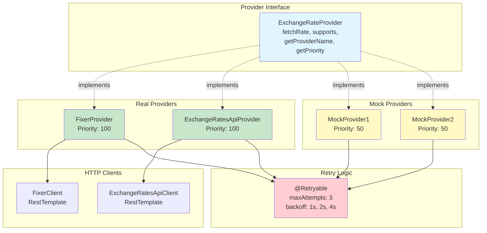
```mermaid
graph TB
    subgraph ProviderInterface["Provider Interface"]
        INT["ExchangeRateProvider<br/>fetchRate, supports,<br/>getProviderName, getPriority"]
    end
    
    subgraph RealProviders["Real Providers"]
        FP["FixerProvider<br/>Priority: 100"]
        EP["ExchangeRatesApiProvider<br/>Priority: 100"]
    end
    
    subgraph MockProviders["Mock Providers"]
        MP1["MockProvider1<br/>Priority: 50"]
        MP2["MockProvider2<br/>Priority: 50"]
    end
    
    subgraph HTTPClients["HTTP Clients"]
        FC["FixerClient<br/>RestTemplate"]
        EC["ExchangeRatesApiClient<br/>RestTemplate"]
    end
    
    subgraph RetryLogic["Retry Logic"]
        RT["@Retryable<br/>maxAttempts: 3<br/>backoff: 1s, 2s, 4s"]
    end
    
    INT -.implements.-> FP
    INT -.implements.-> EP
    INT -.implements.-> MP1
    INT -.implements.-> MP2
    
    FP --> FC
    EP --> EC
    
    FP --> RT
    EP --> RT
    MP1 --> RT
    MP2 --> RT
    
    style INT fill:#e1f5ff
    style FP fill:#c8e6c9
    style EP fill:#c8e6c9
    style MP1 fill:#fff9c4
    style MP2 fill:#fff9c4
    style RT fill:#ffcdd2
```

### Best Rate Selection Algorithm

```mermaid
flowchart TD
    START["Receive Request: USD to EUR"] --> FETCH[Fetch from all providers]
    
    FETCH --> P1["Provider1: 0.85, Priority: 100"]
    FETCH --> P2["Provider2: 0.87, Priority: 100"]
    FETCH --> P3["Provider3: 0.85, Priority: 50"]
    FETCH --> P4[Provider4: FAILED]
    
    P1 --> COLLECT[Collect successful rates]
    P2 --> COLLECT
    P3 --> COLLECT
    P4 -.x.-> COLLECT
    
    COLLECT --> SORT[Sort by rate ASC]
    SORT --> GROUP[Group by rate value]
    
    GROUP --> CHECK{Multiple providers<br/>with same rate?}
    
    CHECK -->|No| SELECT1[Select provider with<br/>lowest rate]
    CHECK -->|Yes| SELECT2[Select provider with<br/>highest priority]
    
    SELECT1 --> SAVE[Save ALL rates to database]
    SELECT2 --> SAVE
    
    SAVE --> RETURN["Return best rate: 0.85 from Provider1<br/>Priority: 100"]
    
    style START fill:#e3f2fd
    style FETCH fill:#fff3e0
    style COLLECT fill:#f3e5f5
    style CHECK fill:#fff9c4
    style SAVE fill:#c8e6c9
    style RETURN fill:#c8e6c9
    style P4 fill:#ffcdd2
```

### Retry Mechanism Flow

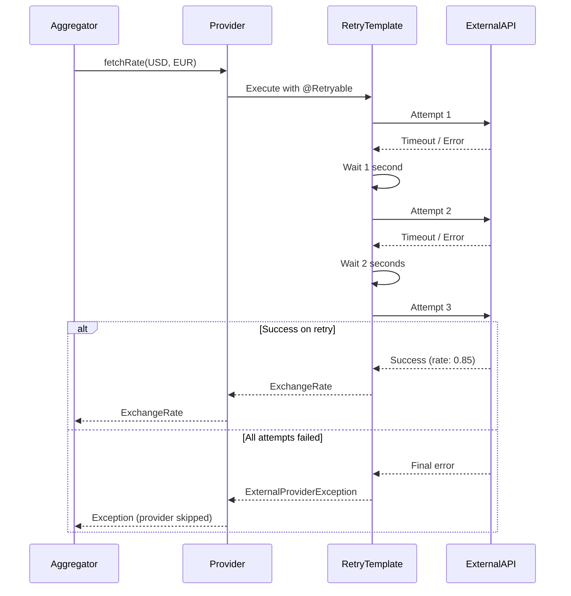
```mermaid
sequenceDiagram
    participant Aggregator
    participant Provider
    participant RetryTemplate
    participant ExternalAPI
    
    Aggregator->>Provider: fetchRate(USD, EUR)
    Provider->>RetryTemplate: Execute with @Retryable
    
    RetryTemplate->>ExternalAPI: Attempt 1
    ExternalAPI-->>RetryTemplate: Timeout / Error
    
    RetryTemplate->>RetryTemplate: Wait 1 second
    RetryTemplate->>ExternalAPI: Attempt 2
    ExternalAPI-->>RetryTemplate: Timeout / Error
    
    RetryTemplate->>RetryTemplate: Wait 2 seconds
    RetryTemplate->>ExternalAPI: Attempt 3
    
    alt Success on retry
        ExternalAPI-->>RetryTemplate: Success (rate: 0.85)
        RetryTemplate-->>Provider: ExchangeRate
        Provider-->>Aggregator: ExchangeRate
    else All attempts failed
        ExternalAPI-->>RetryTemplate: Final error
        RetryTemplate-->>Provider: ExternalProviderException
        Provider-->>Aggregator: Exception (provider skipped)
    end
```

---

## Scheduled Rate Updates

### Scheduler Flow

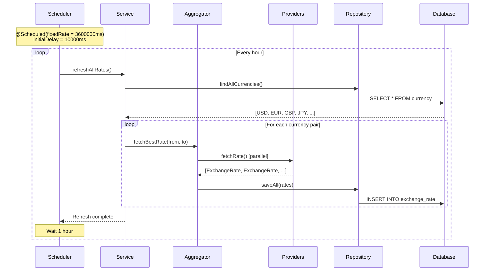
```mermaid
sequenceDiagram
    participant Scheduler
    participant Service
    participant Aggregator
    participant Providers
    participant Repository
    participant Database
    
    Note over Scheduler: @Scheduled(fixedRate = 3600000ms)<br/>initialDelay = 10000ms
    
    loop Every hour
        Scheduler->>Service: refreshAllRates()
        Service->>Repository: findAllCurrencies()
        Repository->>Database: SELECT * FROM currency
        Database-->>Service: [USD, EUR, GBP, JPY, ...]
        
        loop For each currency pair
            Service->>Aggregator: fetchBestRate(from, to)
            Aggregator->>Providers: fetchRate() [parallel]
            Providers-->>Aggregator: [ExchangeRate, ExchangeRate, ...]
            Aggregator->>Repository: saveAll(rates)
            Repository->>Database: INSERT INTO exchange_rate
        end
        
        Service-->>Scheduler: Refresh complete
        
        Note over Scheduler: Wait 1 hour
    end
```

### Scheduling State Diagram

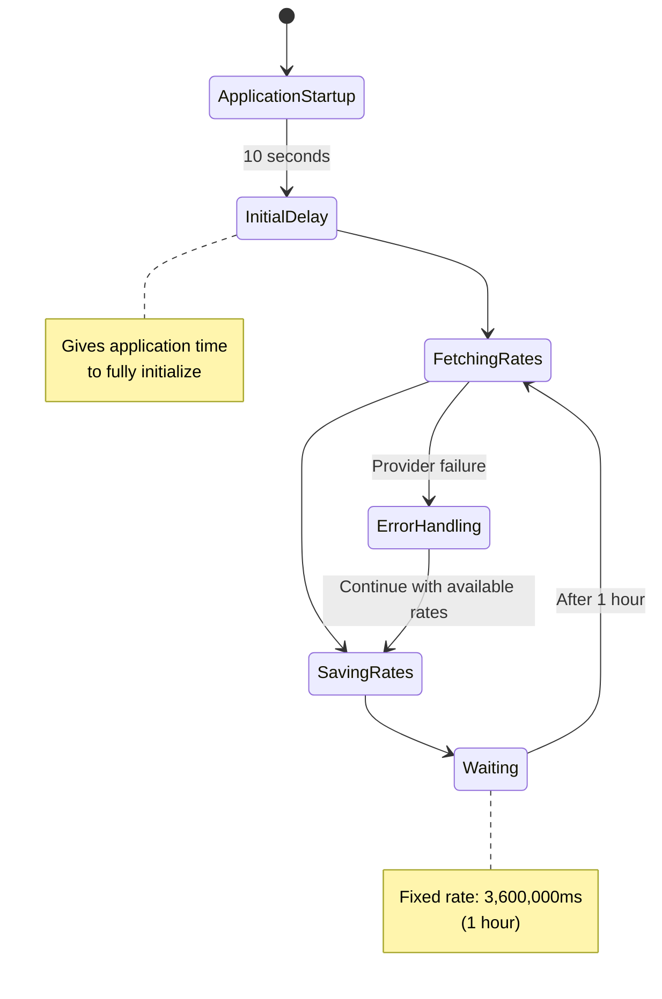
```mermaid
stateDiagram-v2
    [*] --> ApplicationStartup
    ApplicationStartup --> InitialDelay: 10 seconds
    InitialDelay --> FetchingRates
    FetchingRates --> SavingRates
    SavingRates --> Waiting
    Waiting --> FetchingRates: After 1 hour
    
    FetchingRates --> ErrorHandling: Provider failure
    ErrorHandling --> SavingRates: Continue with available rates
    
    note right of InitialDelay
        Gives application time
        to fully initialize
    end note
    
    note right of Waiting
        Fixed rate: 3,600,000ms
        (1 hour)
    end note
```

---

## Data Flow Diagrams

### Complete Request-Response Cycle

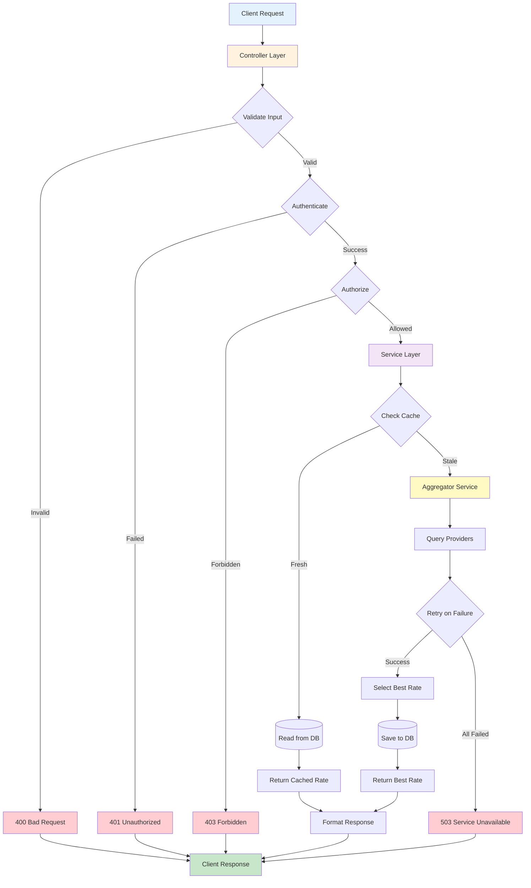
```mermaid
graph TB
    START[Client Request] --> CTRL[Controller Layer]
    CTRL --> VAL{Validate Input}
    
    VAL -->|Invalid| ERR1[400 Bad Request]
    VAL -->|Valid| AUTH{Authenticate}
    
    AUTH -->|Failed| ERR2[401 Unauthorized]
    AUTH -->|Success| AUTHZ{Authorize}
    
    AUTHZ -->|Forbidden| ERR3[403 Forbidden]
    AUTHZ -->|Allowed| SVC[Service Layer]
    
    SVC --> CACHE{Check Cache}
    
    CACHE -->|Fresh| DB1[(Read from DB)]
    CACHE -->|Stale| AGG[Aggregator Service]
    
    AGG --> PROV[Query Providers]
    PROV --> RETRY{Retry on Failure}
    RETRY -->|Success| BEST[Select Best Rate]
    RETRY -->|All Failed| ERR4[503 Service Unavailable]
    
    BEST --> SAVE[(Save to DB)]
    SAVE --> RETURN1[Return Best Rate]
    
    DB1 --> RETURN2[Return Cached Rate]
    
    RETURN1 --> RESP[Format Response]
    RETURN2 --> RESP
    
    RESP --> END[Client Response]
    
    ERR1 --> END
    ERR2 --> END
    ERR3 --> END
    ERR4 --> END
    
    style START fill:#e3f2fd
    style CTRL fill:#fff3e0
    style SVC fill:#f3e5f5
    style AGG fill:#fff9c4
    style END fill:#c8e6c9
    style ERR1 fill:#ffcdd2
    style ERR2 fill:#ffcdd2
    style ERR3 fill:#ffcdd2
    style ERR4 fill:#ffcdd2
```

---

## Configuration and Initialization

### Application Startup Sequence

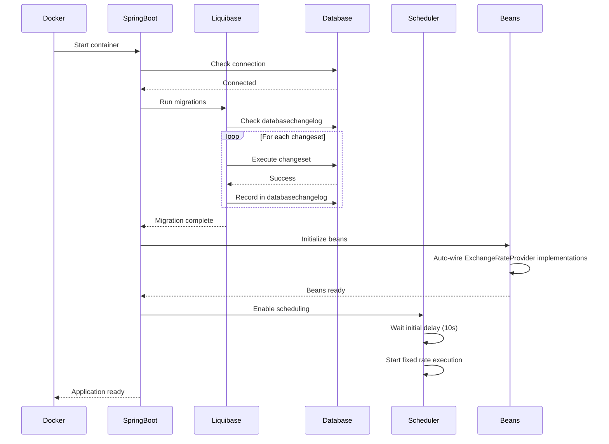
```mermaid
sequenceDiagram
    participant Docker
    participant SpringBoot
    participant Liquibase
    participant Database
    participant Scheduler
    participant Beans
    
    Docker->>SpringBoot: Start container
    SpringBoot->>Database: Check connection
    Database-->>SpringBoot: Connected
    
    SpringBoot->>Liquibase: Run migrations
    Liquibase->>Database: Check databasechangelog
    
    loop For each changeset
        Liquibase->>Database: Execute changeset
        Database-->>Liquibase: Success
        Liquibase->>Database: Record in databasechangelog
    end
    
    Liquibase-->>SpringBoot: Migration complete
    
    SpringBoot->>Beans: Initialize beans
    Beans->>Beans: Auto-wire ExchangeRateProvider implementations
    Beans-->>SpringBoot: Beans ready
    
    SpringBoot->>Scheduler: Enable scheduling
    Scheduler->>Scheduler: Wait initial delay (10s)
    Scheduler->>Scheduler: Start fixed rate execution
    
    SpringBoot-->>Docker: Application ready
```

### Bean Auto-Wiring Flow

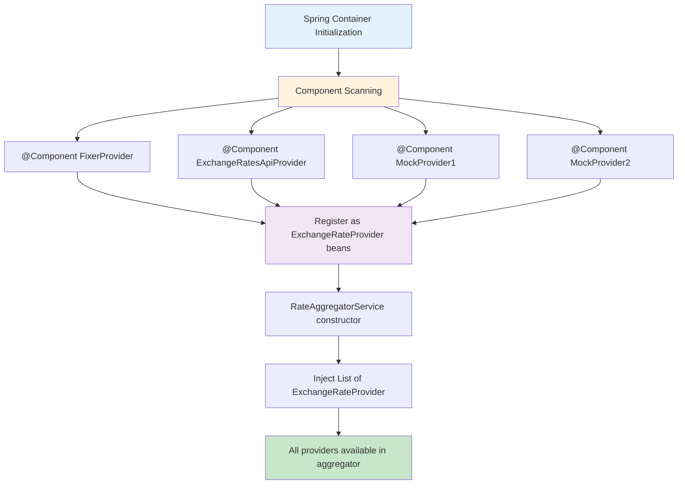
```mermaid
graph TB
    START[Spring Container Initialization] --> SCAN[Component Scanning]
    
    SCAN --> FIND1["@Component FixerProvider"]
    SCAN --> FIND2["@Component ExchangeRatesApiProvider"]
    SCAN --> FIND3["@Component MockProvider1"]
    SCAN --> FIND4["@Component MockProvider2"]
    
    FIND1 --> REG[Register as ExchangeRateProvider beans]
    FIND2 --> REG
    FIND3 --> REG
    FIND4 --> REG
    
    REG --> AGG[RateAggregatorService constructor]
    AGG --> INJECT["Inject List of ExchangeRateProvider"]
    
    INJECT --> READY[All providers available in aggregator]
    
    style START fill:#e3f2fd
    style SCAN fill:#fff3e0
    style REG fill:#f3e5f5
    style READY fill:#c8e6c9
```

---

## Error Handling Flow

### Exception Handling Architecture

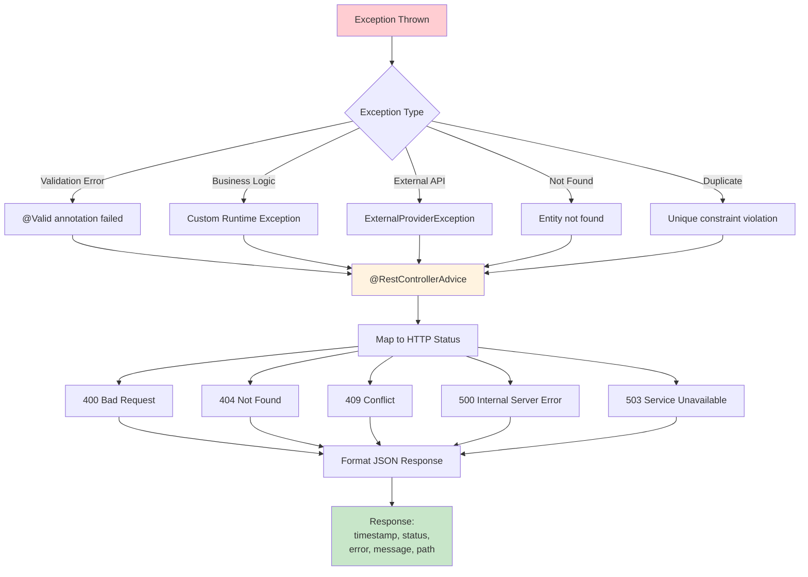
```mermaid
graph TB
    EXC[Exception Thrown] --> TYPE{Exception Type}
    
    TYPE -->|Validation Error| VAL["@Valid annotation failed"]
    TYPE -->|Business Logic| BUS[Custom Runtime Exception]
    TYPE -->|External API| EXT[ExternalProviderException]
    TYPE -->|Not Found| NF[Entity not found]
    TYPE -->|Duplicate| DUP[Unique constraint violation]
    
    VAL --> ADV["@RestControllerAdvice"]
    BUS --> ADV
    EXT --> ADV
    NF --> ADV
    DUP --> ADV
    
    ADV --> MAP[Map to HTTP Status]
    
    MAP --> R400[400 Bad Request]
    MAP --> R404[404 Not Found]
    MAP --> R409[409 Conflict]
    MAP --> R500[500 Internal Server Error]
    MAP --> R503[503 Service Unavailable]
    
    R400 --> JSON[Format JSON Response]
    R404 --> JSON
    R409 --> JSON
    R500 --> JSON
    R503 --> JSON
    
    JSON --> RESP["Response:<br/>timestamp, status,<br/>error, message, path"]
    
    style EXC fill:#ffcdd2
    style ADV fill:#fff3e0
    style RESP fill:#c8e6c9
```

---

**End of Document**
