# Currency Exchange Application - Architecture Plan

## Project Overview
A Spring Boot application for managing currency exchange rates with multiple external providers, caching, scheduled updates, security, and comprehensive testing.

---

## Table of Contents
1. [High-Level Architecture](#high-level-architecture)
2. [Application Layers](#application-layers)
3. [Package Structure](#package-structure)
4. [Detailed Module Design](#detailed-module-design)
5. [Database Schema](#database-schema)
6. [Docker Services](#docker-services)
7. [Implementation Checklist](#implementation-checklist)

---

## High-Level Architecture

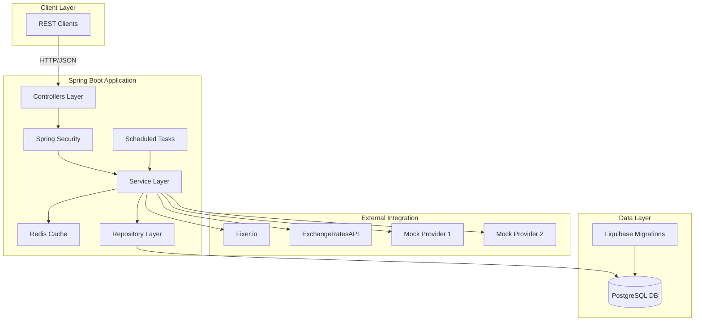

---

## Application Layers

### Layer Architecture

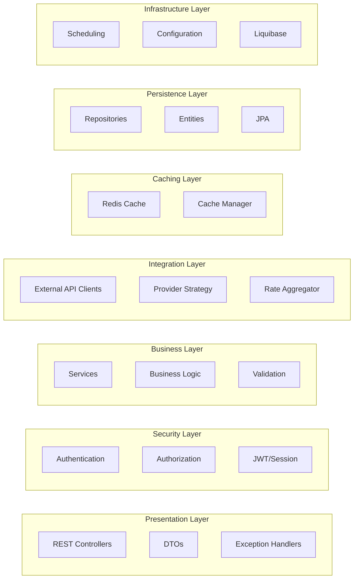

---

## Package Structure

```
com.example.aidemo1
│
├── config/                          # Configuration classes
│   ├── SecurityConfig.java
│   ├── RedisConfig.java
│   ├── SwaggerConfig.java
│   ├── SchedulingConfig.java
│   └── WebConfig.java
│
├── controller/                      # REST Controllers
│   └── api/
│       └── v1/
│           └── CurrencyController.java
│
├── dto/                            # Data Transfer Objects
│   ├── request/
│   │   ├── AddCurrencyRequest.java
│   │   └── ExchangeRateRequest.java
│   ├── response/
│   │   ├── CurrencyResponse.java
│   │   ├── ExchangeRateResponse.java
│   │   ├── TrendResponse.java
│   │   └── ErrorResponse.java
│   └── external/
│       ├── FixerResponse.java
│       └── ExchangeRatesApiResponse.java
│
├── entity/                         # JPA Entities
│   ├── Currency.java
│   ├── ExchangeRate.java
│   ├── User.java
│   └── Role.java
│
├── repository/                     # Spring Data JPA Repositories
│   ├── CurrencyRepository.java
│   ├── ExchangeRateRepository.java
│   ├── UserRepository.java
│   └── RoleRepository.java
│
├── service/                        # Business Logic
│   ├── CurrencyService.java
│   ├── ExchangeRateService.java
│   ├── TrendCalculationService.java
│   ├── UserService.java
│   └── impl/
│       ├── CurrencyServiceImpl.java
│       ├── ExchangeRateServiceImpl.java
│       ├── TrendCalculationServiceImpl.java
│       └── UserServiceImpl.java
│
├── integration/                    # External API Integration
│   ├── provider/
│   │   ├── ExchangeRateProvider.java           # Interface
│   │   ├── FixerProvider.java
│   │   ├── ExchangeRatesApiProvider.java
│   │   └── MockProvider.java
│   ├── client/
│   │   ├── FixerClient.java
│   │   ├── ExchangeRatesApiClient.java
│   │   └── MockProviderClient.java
│   └── aggregator/
│       └── RateAggregatorService.java
│
├── cache/                          # Caching Logic
│   ├── RateCacheService.java
│   └── impl/
│       └── RateCacheServiceImpl.java
│
├── scheduler/                      # Scheduled Tasks
│   └── ExchangeRateScheduler.java
│
├── security/                       # Security Components
│   ├── CustomUserDetailsService.java
│   ├── JwtTokenProvider.java
│   └── SecurityUtils.java
│
├── exception/                      # Custom Exceptions
│   ├── CurrencyNotFoundException.java
│   ├── ExchangeRateNotFoundException.java
│   ├── ExternalProviderException.java
│   ├── InvalidPeriodException.java
│   └── GlobalExceptionHandler.java
│
├── validator/                      # Custom Validators
│   ├── CurrencyCodeValidator.java
│   ├── PeriodValidator.java
│   └── annotation/
│       ├── ValidCurrencyCode.java
│       └── ValidPeriod.java
│
├── enums/                         # Enumerations
│   ├── RoleType.java
│   └── TimePeriod.java
│
└── util/                          # Utility Classes
    ├── DateTimeUtils.java
    ├── CurrencyUtils.java
    └── PeriodParser.java
```

---

## Detailed Module Design

### 1. Controller Layer

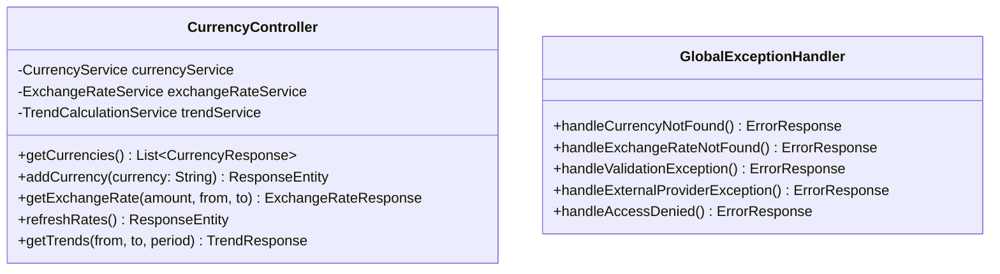

**Endpoints & Security:**
- `GET /api/v1/currencies` - **PUBLIC**
- `POST /api/v1/currencies` - **ADMIN**
- `GET /api/v1/currencies/exchange-rates` - **PUBLIC**
- `POST /api/v1/currencies/refresh` - **ADMIN**
- `GET /api/v1/currencies/trends` - **ADMIN, PREMIUM_USER**

---

### 2. Service Layer

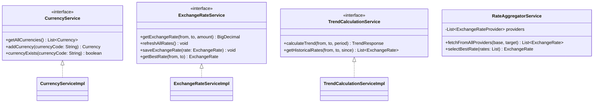

**Service Responsibilities:**

| Service | Responsibilities |
|---------|-----------------|
| **CurrencyService** | Manage currency list, validation, CRUD operations |
| **ExchangeRateService** | Fetch rates, cache management, rate selection logic |
| **TrendCalculationService** | Calculate percentage changes, historical data analysis |
| **RateAggregatorService** | Coordinate multiple providers, select best rates |
| **RateCacheService** | Redis cache operations, cache invalidation |
| **UserService** | User management, authentication support |

---

### 3. Integration Layer (External Providers)

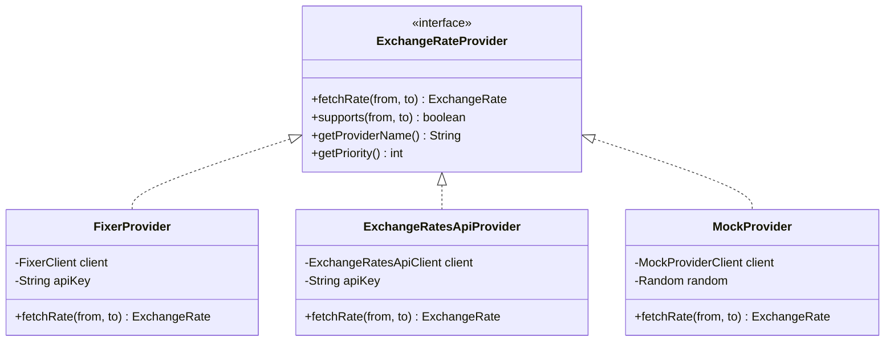

**Provider Strategy:**
- Each provider implements `ExchangeRateProvider` interface
- Priority-based selection (real providers first, then mocks)
- Fallback mechanism if primary provider fails
- Circuit breaker pattern for external API calls

---

### 4. Entity Layer

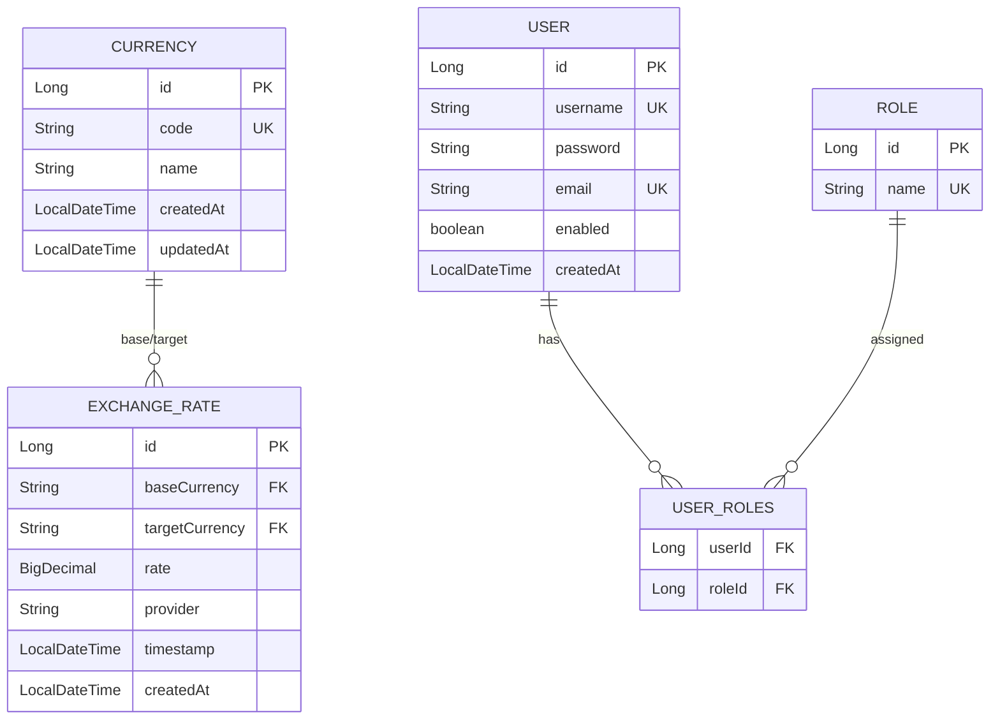

**Entity Details:**

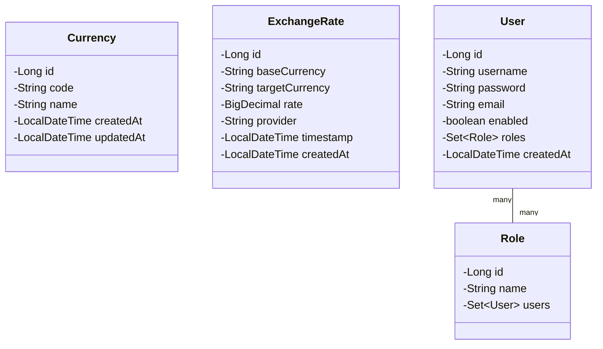

---

### 5. Security Architecture

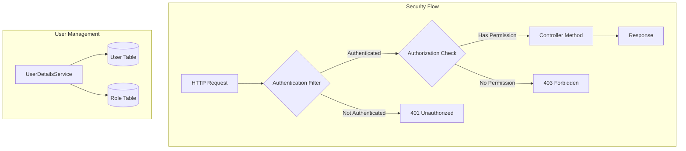

**Security Configuration:**

| Role | Permissions |
|------|-------------|
| **USER** | GET /api/v1/currencies, GET /api/v1/currencies/exchange-rates |
| **PREMIUM_USER** | All USER permissions + GET /api/v1/currencies/trends |
| **ADMIN** | All permissions including POST endpoints |

**Security Components:**
- `SecurityConfig` - Configure HTTP security, endpoint access rules
- `CustomUserDetailsService` - Load user from database
- `PasswordEncoder` - BCrypt password encoding
- Form-based login page
- Session management

---

### 6. Caching Strategy

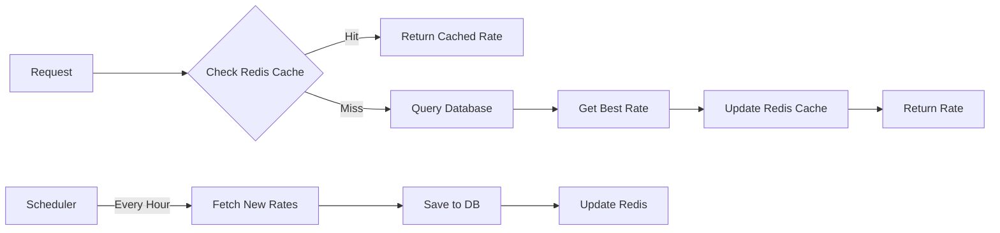

**Cache Design:**
- **Key Pattern**: `exchange_rate:{from}:{to}`
- **Value**: JSON serialized best rate
- **TTL**: 1 hour (aligned with scheduler)
- **Eviction**: On refresh, invalidate all keys
- **Fallback**: Query database if Redis unavailable

---

### 7. Scheduler Design

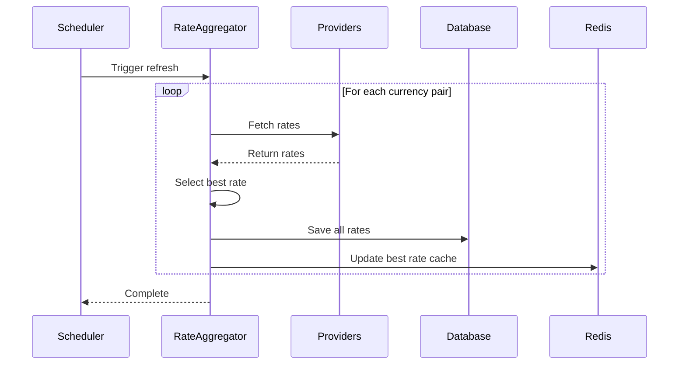

**Scheduler Configuration:**
- **Cron Expression**: `@Scheduled(cron = "0 0 * * * *")` - Every hour
- **Initial Delay**: `initialDelay = 60000` - 1 minute after startup
- **Async Execution**: Use `@Async` for non-blocking
- **Error Handling**: Catch and log exceptions, don't fail silently

---

## Database Schema

### Liquibase Changelog Structure

```
src/main/resources/db/changelog/
│
├── db.changelog-master.yaml          # Master changelog
│
├── changes/
│   ├── 001-create-currency-table.yaml
│   ├── 002-create-exchange-rate-table.yaml
│   ├── 003-create-user-table.yaml
│   ├── 004-create-role-table.yaml
│   ├── 005-create-user-roles-table.yaml
│   ├── 006-add-indexes.yaml
│   └── 007-insert-default-roles.yaml
```

### Key Indexes

```sql
-- For fast rate lookups
CREATE INDEX idx_exchange_rate_currencies ON exchange_rate(base_currency, target_currency);
CREATE INDEX idx_exchange_rate_timestamp ON exchange_rate(timestamp DESC);

-- For trend calculations
CREATE INDEX idx_exchange_rate_period ON exchange_rate(base_currency, target_currency, timestamp);

-- For user authentication
CREATE UNIQUE INDEX idx_user_username ON user(username);
CREATE UNIQUE INDEX idx_user_email ON user(email);
```

---

## Docker Services

### Service Architecture

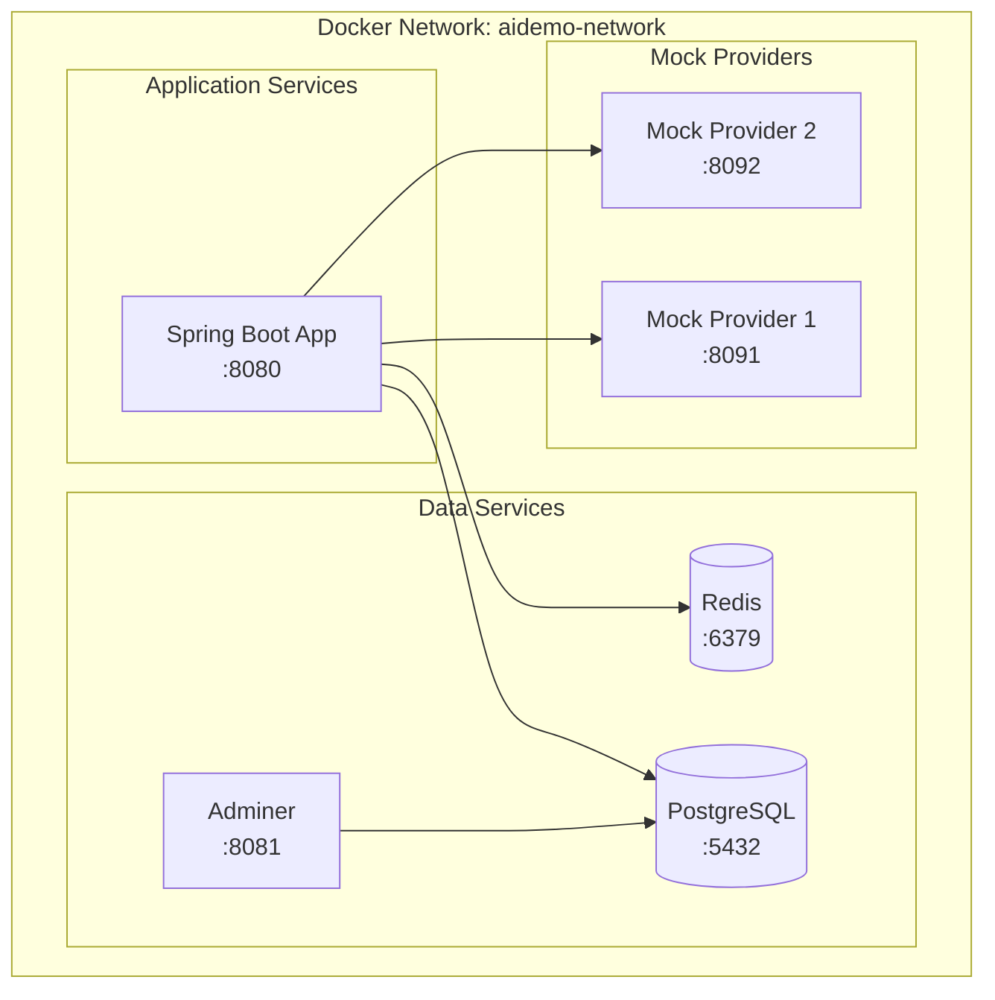

### Docker Compose Services

| Service | Image | Port | Purpose |
|---------|-------|------|---------|
| **postgres** | postgres:17.6 | 5432 | Main database |
| **redis** | redis:7-alpine | 6379 | Cache layer |
| **adminer** | adminer:5.4.0 | 8081 | DB management UI |
| **app** | Custom (Dockerfile) | 8080 | Main Spring Boot application |
| **mock-provider-1** | Custom (Dockerfile) | 8091 | Mock exchange rate provider |
| **mock-provider-2** | Custom (Dockerfile) | 8092 | Mock exchange rate provider |

---

## Implementation Checklist

### 📊 Overall Progress Summary

**Last Updated:** October 15, 2025

| Phase | Status | Completion | Key Deliverables |
|-------|--------|------------|------------------|
| **Phase 1** | ✅ Complete | 100% | Project setup, Docker, Maven, dependencies |
| **Phase 2** | ✅ Complete | 100% | Entities (4), Repositories (4), Liquibase (7 changesets) |
| **Phase 3** | ✅ Complete | 100% | Providers (4), Clients (4), Aggregator, 106+ tests |
| **Phase 4** | ✅ Complete | 100% | Redis config, Cache service, 7 tests |
| **Phase 5** | 🔄 In Progress | 25% | CurrencyService ✅, ExchangeRateService pending |
| **Phase 6** | ⚠️ Partial | 25% | SecurityConfig ✅, UserDetailsService pending |
| **Phase 7** | ❌ Not Started | 0% | REST API, DTOs, Controllers, Exception handlers |
| **Phase 8** | ❌ Not Started | 0% | Custom validators, validation annotations |
| **Phase 9** | ❌ Not Started | 0% | Swagger/OpenAPI documentation |
| **Phase 10** | ❌ Not Started | 0% | Comprehensive testing suite |
| **Phase 11** | ❌ Not Started | 0% | Code quality tools (Jacoco, Checkstyle, PMD) |
| **Phase 12** | ❌ Not Started | 0% | End-to-end testing, performance testing |
| **Phase 13** | ❌ Not Started | 0% | Deployment optimization, monitoring |

**Overall Project Completion:** ~45% (4.25 / 13 phases)

**Recent Accomplishments:**
- ✅ Phase 5.1: CurrencyService with full test coverage (20 tests, 100% passing)
- ✅ Phase 4: Complete Redis caching implementation
- ✅ Phase 3.4: Rate aggregator with intelligent selection algorithm

**Next Milestone:**
- 🎯 Phase 5.2: ExchangeRateService implementation

---

### Phase 1: Project Setup & Infrastructure ✅ **COMPLETED**
- [x] **1.1** Set up Spring Boot project structure ✅
  - [x] Configure Maven dependencies (Web, Data JPA, Security, Redis, Validation)
  - [x] Add Lombok dependency
  - [x] Add PostgreSQL driver
  - [x] Add Liquibase
  - [x] Add OpenAPI/Swagger dependencies
- [x] **1.2** Configure application.properties/yml ✅
  - [x] Database connection settings
  - [x] Redis connection settings
  - [x] Logging configuration
  - [x] Scheduler settings
- [x] **1.3** Set up Docker infrastructure ✅
  - [x] Update docker-compose.yml with Redis
  - [x] Create Dockerfile for main app
  - [x] Create mock provider services (2 separate Spring Boot apps)
  - [x] Configure Docker network

### Phase 2: Database Layer ✅ **COMPLETED**
- [x] **2.1** Create JPA Entities ✅
  - [x] Currency entity with validation
  - [x] ExchangeRate entity
  - [x] User entity
  - [x] Role entity
  - [x] Configure relationships (@ManyToMany for User-Role)
- [x] **2.2** Create Spring Data Repositories ✅
  - [x] CurrencyRepository with custom queries
  - [x] ExchangeRateRepository with time-based queries
  - [x] UserRepository with findByUsername
  - [x] RoleRepository
- [x] **2.3** Set up Liquibase migrations ✅
  - [x] Master changelog
  - [x] Table creation migrations
  - [x] Index creation
  - [x] Default data (roles: USER, PREMIUM_USER, ADMIN)
  - [x] Test users with encrypted passwords

### Phase 3: External Integration Layer ✅ **COMPLETED**
- [x] **3.1** Define ExchangeRateProvider interface ✅
  - [x] Common methods: fetchRate, supports, getPriority
- [x] **3.2** Implement Real Providers ✅
  - [x] FixerProvider with REST client
  - [x] ExchangeRatesApiProvider with REST client
  - [x] HTTP client configuration (RestTemplate/WebClient)
  - [x] Error handling and retries
- [x] **3.3** Create Mock Provider Services ✅
  - [x] Mock Service 1: Simple random rate generator
  - [x] Mock Service 2: Simple random rate generator
  - [x] REST endpoints returning random rates
  - [x] Dockerize both services
- [x] **3.4** Implement Rate Aggregator ✅
  - [x] Fetch from all providers
  - [x] Select best rate logic
  - [x] Handle provider failures

### Phase 4: Caching Layer ✅ **COMPLETED**
- [x] **4.1** Configure Redis ✅
  - [x] RedisConfig with connection factory
  - [x] Redis template configuration
  - [x] Serialization settings
- [x] **4.2** Implement RateCacheService ✅
  - [x] Store rate in Redis
  - [x] Retrieve rate from Redis
  - [x] Invalidate cache
  - [x] Cache key generation

### Phase 5: Business Logic Layer
- [x] **5.1** Implement CurrencyService ✅ **COMPLETED (Oct 15, 2025)**
  - [x] Get all currencies
  - [x] Add new currency with validation
  - [x] Check currency existence
- [ ] **5.2** Implement ExchangeRateService
  - [ ] Get exchange rate (check cache → DB → providers)
  - [ ] Refresh all rates
  - [ ] Save rates to database
  - [ ] Get best rate logic
- [ ] **5.3** Implement TrendCalculationService
  - [ ] Parse period string (12H, 10D, 3M, 1Y)
  - [ ] Fetch historical rates
  - [ ] Calculate percentage change
  - [ ] Handle edge cases (no data)
- [ ] **5.4** Implement Scheduler
  - [ ] Scheduled method to refresh rates
  - [ ] Call RateAggregator
  - [ ] Update cache and database
  - [ ] Error handling and logging

### Phase 6: Security Layer ⚠️ **PARTIALLY COMPLETED**
- [x] **6.1** Configure Spring Security ✅
  - [x] SecurityConfig with HTTP security
  - [x] Endpoint access rules
  - [x] Form login configuration
  - [x] Password encoder bean
- [ ] **6.2** Implement CustomUserDetailsService
  - [ ] Load user from database
  - [ ] Map roles to authorities
- [ ] **6.3** Create login page (optional: use default)
- [ ] **6.4** Test security with different roles

### Phase 7: REST API Layer
- [ ] **7.1** Create DTOs
  - [ ] Request DTOs with validation annotations
  - [ ] Response DTOs
  - [ ] External provider DTOs
  - [ ] ErrorResponse DTO
- [ ] **7.2** Implement CurrencyController
  - [ ] GET /api/v1/currencies
  - [ ] POST /api/v1/currencies
  - [ ] GET /api/v1/currencies/exchange-rates
  - [ ] POST /api/v1/currencies/refresh
  - [ ] GET /api/v1/currencies/trends
  - [ ] Add validation annotations
  - [ ] Add security annotations
- [ ] **7.3** Implement Global Exception Handler
  - [ ] CurrencyNotFoundException → 404
  - [ ] ExchangeRateNotFoundException → 404
  - [ ] ValidationException → 400
  - [ ] ExternalProviderException → 502
  - [ ] AccessDeniedException → 403
  - [ ] Generic exceptions → 500

### Phase 8: Validation & Custom Validators
- [ ] **8.1** Create custom validation annotations
  - [ ] @ValidCurrencyCode (ISO 4217)
  - [ ] @ValidPeriod (12H, 10D, 3M, 1Y format)
- [ ] **8.2** Implement validators
  - [ ] CurrencyCodeValidator
  - [ ] PeriodValidator
- [ ] **8.3** Add validation to DTOs
  - [ ] @NotNull, @NotEmpty, @Positive
  - [ ] Custom annotations

### Phase 9: Documentation
- [ ] **9.1** Configure Swagger/OpenAPI
  - [ ] SwaggerConfig
  - [ ] API info metadata
  - [ ] Security scheme definition
- [ ] **9.2** Add API annotations
  - [ ] @Operation, @ApiResponse
  - [ ] @Parameter, @Schema
  - [ ] Document error responses
- [ ] **9.3** Test Swagger UI at /swagger-ui.html

### Phase 10: Testing
- [ ] **10.1** Unit Tests
  - [ ] Service layer tests with Mockito
  - [ ] Repository tests with @DataJpaTest
  - [ ] Validator tests
  - [ ] Utility class tests
  - [ ] Coverage: aim for 80%+
- [ ] **10.2** Integration Tests with TestContainers
  - [ ] Set up TestContainers (PostgreSQL, Redis)
  - [ ] Service integration tests
  - [ ] Repository integration tests
  - [ ] Full flow tests
- [ ] **10.3** Controller Tests
  - [ ] @WebMvcTest for controller validation
  - [ ] Test validation annotations
  - [ ] Test error handling
- [ ] **10.4** API Tests with WireMock
  - [ ] Mock external provider responses
  - [ ] Test successful scenarios
  - [ ] Test failure scenarios
  - [ ] Test fallback logic
- [ ] **10.5** Security Tests
  - [ ] Test endpoint access with different roles
  - [ ] Test authentication failures
  - [ ] Test authorization failures

### Phase 11: Code Quality Tools
- [ ] **11.1** Configure Jacoco
  - [ ] Add Maven plugin
  - [ ] Set coverage thresholds
  - [ ] Generate reports
- [ ] **11.2** Configure Checkstyle
  - [ ] Add Maven plugin
  - [ ] Configure checkstyle.xml
  - [ ] Fix violations
- [ ] **11.3** Configure PMD
  - [ ] Add Maven plugin
  - [ ] Configure ruleset
  - [ ] Fix violations
- [ ] **11.4** (Optional) Configure PiTest
  - [ ] Add Maven plugin
  - [ ] Run mutation tests
  - [ ] Improve test quality

### Phase 12: Final Integration & Testing
- [ ] **12.1** End-to-End Testing
  - [ ] Start all Docker services
  - [ ] Test complete workflows
  - [ ] Test with Postman/curl
- [ ] **12.2** Performance Testing
  - [ ] Test cache performance
  - [ ] Test scheduler execution
  - [ ] Test concurrent requests
- [ ] **12.3** Documentation Review
  - [ ] README with setup instructions
  - [ ] API documentation complete
  - [ ] Code comments
  - [ ] Architecture diagrams

### Phase 13: Deployment & DevOps
- [ ] **13.1** Docker Optimization
  - [ ] Multi-stage Dockerfile
  - [ ] Image size optimization
  - [ ] Health checks
- [ ] **13.2** Environment Configuration
  - [ ] Externalize configuration
  - [ ] Environment-specific properties
  - [ ] Secrets management
- [ ] **13.3** Monitoring & Logging
  - [ ] Structured logging
  - [ ] Application metrics
  - [ ] Health endpoints

---

## Additional Diagrams

### Complete Data Flow

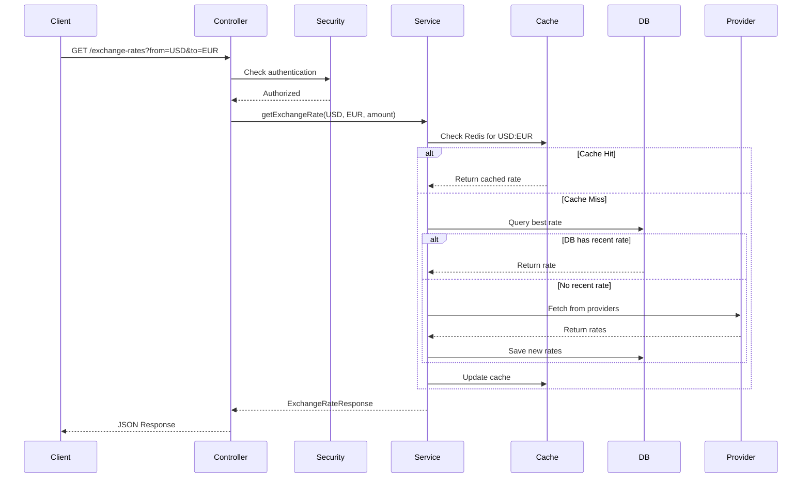

### Trend Calculation Flow

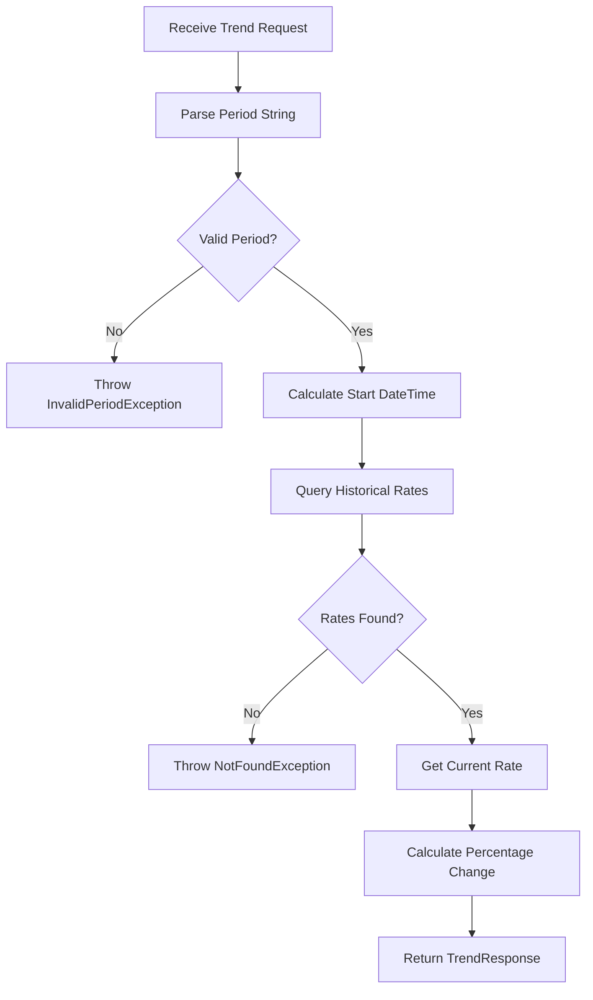

---

## Technology Stack Summary

| Category | Technology | Purpose |
|----------|-----------|---------|
| **Framework** | Spring Boot 3.x | Main application framework |
| **Language** | Java 21 | Programming language |
| **Build Tool** | Maven | Dependency management & build |
| **Database** | PostgreSQL 17.6 | Persistent storage |
| **Cache** | Redis 7 | In-memory cache for rates |
| **Migration** | Liquibase | Database schema management |
| **ORM** | Spring Data JPA / Hibernate | Data access layer |
| **Security** | Spring Security | Authentication & authorization |
| **Validation** | Bean Validation (JSR-380) | Input validation |
| **API Docs** | Swagger/OpenAPI 3 | API documentation |
| **Testing** | JUnit 5 | Unit testing framework |
| **Testing** | Spring Test | Integration testing |
| **Testing** | TestContainers | Container-based integration tests |
| **Testing** | WireMock | HTTP API mocking |
| **Testing** | Mockito | Mocking framework |
| **Code Quality** | Jacoco | Code coverage |
| **Code Quality** | Checkstyle | Code style checking |
| **Code Quality** | PMD | Static code analysis |
| **Code Quality** | PiTest (optional) | Mutation testing |
| **Containerization** | Docker & Docker Compose | Container orchestration |
| **Utilities** | Lombok | Boilerplate reduction |

---

## Next Steps

After completing this architecture plan, the implementation should follow this order:

1. **Start with infrastructure** (Phase 1-2): Database, entities, repositories
2. **Build integration layer** (Phase 3): External providers and mocks
3. **Implement business logic** (Phase 4-5): Services and caching
4. **Add security** (Phase 6): Spring Security configuration
5. **Create REST API** (Phase 7-8): Controllers and validation
6. **Document** (Phase 9): Swagger/OpenAPI
7. **Test thoroughly** (Phase 10): Unit, integration, and functional tests
8. **Quality assurance** (Phase 11): Code quality tools
9. **Final testing** (Phase 12): End-to-end and performance
10. **Deploy** (Phase 13): Docker optimization and monitoring

---

## Notes

- Use `Optional` for all methods that might return null
- Leverage Stream API for collection operations
- Apply Lombok annotations (@Data, @Builder, @Slf4j) consistently
- Follow RESTful conventions for API design
- Implement proper exception handling at every layer
- Write tests before or alongside implementation (TDD approach)
- Keep services focused and single-responsibility
- Use dependency injection throughout
- Make configuration externalized and environment-agnostic
- Document complex business logic with comments

